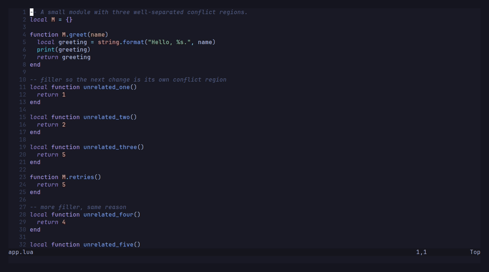
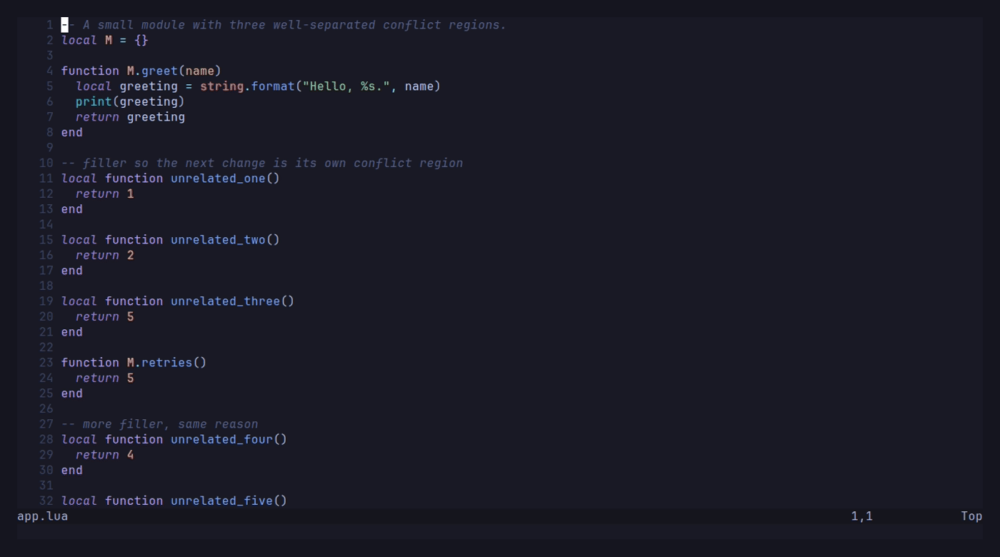
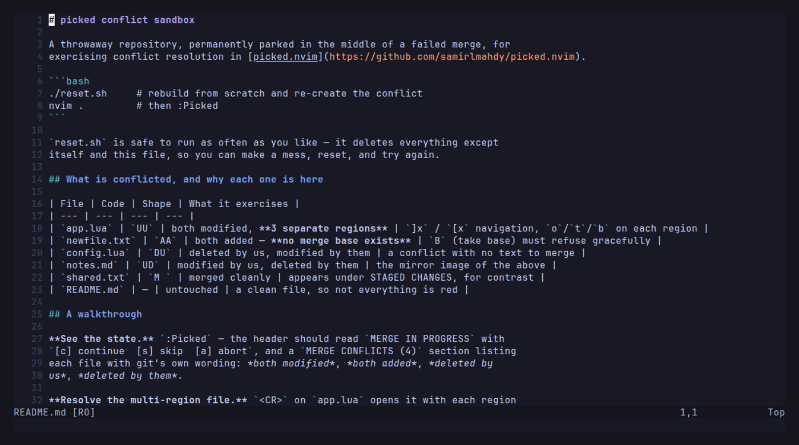
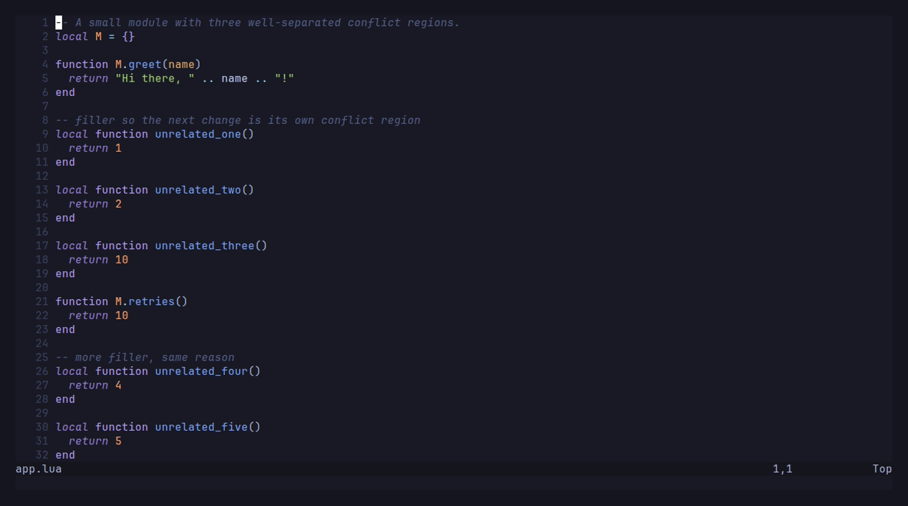

# picked.nvim

[](https://github.com/samirlmahdy/picked.nvim/actions/workflows/ci.yml)
[](https://github.com/samirlmahdy/picked.nvim/releases)
[](LICENSE)

> **Pick exactly what goes into your next commit.**

**picked.nvim** is a keyboard-first Git workspace for Neovim. Stage an entire
file, one hunk, or exactly the lines you select—then commit, inspect history,
resolve conflicts, and manage branches without leaving the editor.



Built entirely from Neovim primitives: buffers, windows, extmarks, signs,
keymaps, and asynchronous jobs. The core has no plugin dependencies.

## Why picked?

- **Stage precisely.** Work by repository, directory, file, hunk, or visual
  line selection.
- **See the real comparison.** Unified and native `:diffthis` views clearly
  label HEAD, index, working tree, commits, and branches.
- **Keep one workflow.** Status, commits, history, blame, branches, stashes,
  remotes, conflicts, and sequencer operations share one interface.
- **Stay responsive.** Git commands run asynchronously, with stale results
  discarded when newer repository state arrives.
- **Use safe defaults.** Destructive actions explain and confirm what will be
  lost; force-push uses `--force-with-lease`.
- **Generate commit messages when you want.** GitHub Copilot CLI support is
  optional, explicit, and always leaves the result editable.

## Installation

### lazy.nvim

```lua
{
  "samirlmahdy/picked.nvim",
  cmd = { "Picked", "PickedOpen", "PickedToggle", "PickedLog", "PickedBranch", "PickedBlame" },
  keys = {
    { "<leader>guu", "<cmd>PickedToggle<cr>", desc = "Source Control" },
    { "<leader>guc", "<cmd>PickedCommit<cr>", desc = "Commit" },
    { "<leader>gul", "<cmd>PickedLog<cr>", desc = "Commit history" },
  },
  opts = {},
}
```

<details>
<summary>Other plugin managers</summary>

### packer.nvim

```lua
use({
  "samirlmahdy/picked.nvim",
  config = function()
    require("picked").setup({})
  end,
})
```

### vim-plug

```vim
Plug 'samirlmahdy/picked.nvim'
lua require('picked').setup({})
```

</details>

`setup()` is optional—the commands self-initialise. Call it to change defaults.

## Quick start

1. Open Neovim anywhere inside a Git repository.
2. Press `<leader>guu` to open Source Control.
3. Move with `j` / `k`; selecting a file previews its diff automatically.
4. Press `s` to stage, `u` to unstage, or `x` to discard. Inside a diff,
   visually select lines and press `s` to stage exactly that selection.
5. Press `c` to commit. Write the message yourself or press `<C-g>` for an
   editable Copilot suggestion, then `<C-s>` or `:w` to commit.
6. Press `p` to push and `?` at any time for contextual help generated from
   your configuration.

Set `diff = { preview = false }` if you prefer opening previews explicitly
with `d`.

## See it in action

### Generate a commit message with GitHub Copilot

Press `<C-g>` in the commit editor. picked sends the staged diff to GitHub
Copilot CLI and inserts the returned message for review—it never commits on
your behalf. The Copilot process is denied shell, filesystem, and web tools; it
can only return text.



Copilot is optional. Install or update its CLI separately:

```bash
npm install -g @github/copilot@latest
```

### Resolve merge conflicts

Keep ours, theirs, both, the merge base, or neither for each conflict. Navigate
regions, stage resolved files, and continue or abort the operation from the
same interface.



### Follow history and blame

Browse the commit graph, file and line history, and a blame view synchronized
with the source file. The selected line's whole commit block is highlighted in
both panes.



## Feature overview

| Area | Included |
| --- | --- |
| Source Control | Staged, unstaged, untracked, and conflicted files; tree or flat layout; multi-selection actions |
| Diffs | Unified and native side-by-side views; hunk navigation; file, hunk, and selected-line staging |
| History | Commit graph and details, file history across renames, line history, synchronized blame |
| Commits | Real `gitcommit` buffer, amend, commit and push, signing inheritance, optional Copilot suggestions |
| Branches and remotes | Create, switch, rename, delete, merge, rebase, upstreams, push, pull, fetch, and prune |
| Stashes | Push, list, inspect, apply, pop, drop, and branch |
| Recovery and sequencing | Resolve conflicts; continue, skip, or abort merges, rebases, cherry-picks, and reverts |
| Hosting | Open repositories, files, ranges, and commits on GitHub, GitLab, Bitbucket, Gitea, SourceHut, or self-hosted forges |
| Editor integration | Change signs, command palette, contextual menus, mouse support, statusline API, Telescope, Snacks, fzf-lua, and which-key |

## Requirements

- Neovim **0.10+** (`0.10.4`, current stable, and nightly are tested in CI)
- Git **2.20+** (`2.23+` recommended for `git switch` / `git restore`)

Nerd Fonts are optional. picked detects glyph support and falls back to ASCII;
state is never communicated by colour alone.

GitHub Copilot CLI is optional and only required for generated commit
messages. Keep it current: old CLI versions may request models the API no
longer serves.

---

## Keybindings

`?` in any panel shows the current mappings. Everything below is configurable.

### Global

Everything lives under one prefix, `<leader>gu` by default. picked deliberately
does **not** squat on `<leader>g`: distributions like LazyVim already own most
of it, and a silently skipped mapping is worse than an unfamiliar one. One line
moves the whole set:

```lua
require("picked").setup({ prefix = "<leader>gui" })
```

| Key | Action |
| --- | --- |
| `<leader>guu` | Toggle the Source Control panel |
| `<leader>gud` | Diff the current file |
| `<leader>gub` | Branches |
| `<leader>gul` | Commit history |
| `<leader>guh` | History of the current file |
| `<leader>guc` | Commit |
| `<leader>gup` / `<leader>guP` | Push / Pull |
| `<leader>guf` | Fetch |
| `<leader>gus` | Stashes |
| `<leader>guB` | Blame the current file |
| `<leader>gu<space>` | Command palette |

### In any file buffer

| Key | Action |
| --- | --- |
| `]c` / `[c` | Next / previous hunk — falls through to Neovim's own diff motions inside a diff |
| `<leader>guS` | Stage the hunk (or, in visual mode, the selected lines) |
| `<leader>guU` | Unstage the hunk |
| `<leader>guX` | Discard the hunk (or the selected lines) |
| `<leader>guv` | Preview the hunk |
| `<leader>guL` | Blame the current line |

### Source Control panel

| Key | Action |
| --- | --- |
| *(cursor)* | Selecting a file shows its diff automatically |
| `<CR>` | Open the file for editing / expand the row |
| `s` / `u` / `x` | Stage / unstage / discard |
| `S` / `U` | Stage all / unstage all |
| `d` / `D` | Diff this entry / diff everything against HEAD |
| `c` / `ca` / `cP` | Commit / amend / commit & push |
| `p` / `P` / `f` | Push / pull / fetch |
| `b` / `l` / `z` | Branches / log / stashes |
| `B` / `h` | Blame / file history |
| `o` | Open on the remote's website |
| `za` / `zA` | Toggle this node / everything |
| `]f` / `[f` | Next / previous file |
| `m` | Contextual menu |
| `r` / `?` / `q` | Refresh / help / close |

`q` closes whichever picked pane you are in, including the sidebar. Dismissing a
diff hands your editor window back with the buffer that was in it — picked
borrows the window, it does not take it. Closing the sidebar closes the
side-by-side split too: the diff belongs to the list that opened it.

Previews are not debounced. `preview_delay` is 0, so the diff is requested on
the cursor move itself; answers you have already scrolled past are thrown away
as they arrive. Set it to a number of milliseconds if you would rather trade
that responsiveness for fewer git calls.

Opening a file with `<CR>` takes that window back from the diff, so the two
never pile up: you get the sidebar and one editor window, showing whichever of
the file or its diff you last asked for.

Floating views get out of the way on their own. Opening a diff, a file or a
commit from the history dismisses the float that launched it, so the thing you
asked for is never hidden underneath it, and only one picked float is ever on
screen at a time.

Visual mode works in the panel: select several rows and press `s`, `u` or `x`.

### Diff view

| Key | Action |
| --- | --- |
| `s` / `u` / `x` | Stage / unstage / discard the hunk |
| `s` / `x` *(visual)* | Stage / discard exactly the selected lines |
| `]c` / `[c` | Next / previous hunk |
| `]f` / `[f` | Next / previous file |
| `<Tab>` | Switch what is compared (HEAD↔index / index↔worktree) |
| `<C-v>` | Switch presentation (unified patch ↔ side-by-side) |
| `<CR>` | Open the real file at this line |

### Commit editor

| Key | Action |
| --- | --- |
| `<C-g>` | Suggest an editable message with GitHub Copilot CLI |
| `<C-s>` / `:w` | Commit |
| `<C-p>` | Commit and push |
| `<C-a>` | Toggle amend |
| `<C-c>` / `<Esc>` | Cancel and keep the message as a draft |

In the side-by-side view `]c` / `[c` are Neovim's own diff motions, so folding
and `do` / `dp` work too. picked installs no mappings on your real file buffer
there — `:PickedDiffView` returns to the unified patch from either pane.

### Unified or side-by-side

Three ways to choose, depending on how permanent you want it:

```vim
<C-v>              " toggle the diff you are looking at, either direction
:PickedDiffView    " same, and works from the split's real-file pane
:PickedDiff!       " open straight into side-by-side
```

```lua
require("picked").setup({
  diff = {
    view = "unified",        -- "unified" | "split" — what a diff opens as
    layout = "vertical",     -- "vertical" | "horizontal" — how it is arranged
    split_full_width = true, -- give the split the whole editor area
  },
})
```

The two sides each get **half the width left after the sidebar**, and stay that
way as windows come and go. `split_full_width` is what makes that possible: it
closes other ordinary file windows first, because otherwise the panes compete
with them and end up a third of the screen each — too narrow to read a diff in.
Only windows close; buffers stay loaded with any unsaved changes. Set it to
`false` to keep every window and let Neovim divide the space.

`view = "split"` applies to previews too, so moving down the file list shows
each change side by side. The cursor stays in the list while you browse;
`<CR>` moves it into the diff, and `q` in either pane closes the split and
returns the cursor to the file you were on. Both presentations support `]c` /
`[c`; only the unified one can stage, because hunk and line staging need a
patch.

`'winwidth'` would otherwise fight this — it widens the focused window at its
neighbours' expense, stretching the sidebar and crushing one pane — so picked
lowers it to fit while it holds those windows and hands your value back
afterwards.

### Conflicts

| Key | Action |
| --- | --- |
| `o` / `t` / `b` | Keep ours / theirs / both |
| `B` / `n` | Keep the merge base / neither |
| `]x` / `[x` | Next / previous conflict |
| `s` | Stage the file as resolved |

---

## Commands

| Command | Description |
| --- | --- |
| `:Picked`, `:PickedToggle` | Toggle the Source Control panel |
| `:PickedOpen`, `:PickedFocus`, `:PickedClose` | Open / focus / close |
| `:PickedRefresh[!]` | Re-read state (`!` refreshes every repository) |
| `:PickedDiff [all\|staged][!]` | Diff (`!` uses the side-by-side view) |
| `:PickedDiffView` | Toggle unified ↔ side-by-side |
| `:PickedCommit[!] [message]` | Commit (`!` amends) |
| `:PickedCommitSuggest` | Suggest a message with GitHub Copilot CLI |
| `:PickedPush[!]` | Push (`!` force-pushes with lease) |
| `:PickedPull`, `:PickedFetch[!]` | Pull / fetch (`!` fetches all remotes) |
| `:PickedLog[!]`, `:PickedBranch`, `:PickedStash` | History / branches / stashes |
| `:PickedBlame`, `:PickedBlameLine` | Blame the file / toggle line blame |
| `:[range]PickedHistory` | File history, or line history for a range |
| `:PickedStage`, `:PickedUnstage` | Stage / unstage paths |
| `:[range]PickedStageHunk`, `:PickedUnstageHunk`, `:[range]PickedDiscardHunk` | Hunk actions |
| `:PickedNextHunk`, `:PickedPrevHunk`, `:PickedPreviewHunk` | Hunk navigation |
| `:PickedConflict[!]` | Next conflict (`!` opens the three-way view) |
| `:PickedPalette`, `:PickedRepositories` | Palette / repository picker |
| `:PickedOutput`, `:PickedDebugLog`, `:PickedHealth` | Diagnostics |

---

## Configuration

Every value below is a default; pass only what you want to change.

```lua
require("picked").setup({
  position = "left",          -- "left" | "right" | "float"
  width = 42,
  compact_width = 34,         -- below this, the panel drops decorations

  -- What the sidebar does when it would be the only window left:
  --   "keep_width"  hold its width, parking an empty window beside it
  --   "expand"      let Neovim stretch it (its default behaviour)
  --   "close"       close the panel too
  last_window = "keep_width",

  prefix = "<leader>gu",      -- every global mapping lives under this

  auto_refresh = true,
  refresh_debounce = 250,
  file_watch = true,

  timeout = 20000,            -- ms, ordinary commands
  network_timeout = 120000,   -- ms, push/pull/fetch

  log_level = "warn",         -- trace | debug | info | warn | error | off
  icons = "auto",             -- true | false | "auto"
  tree = true,                -- tree vs flat list
  tree_flatten = true,        -- collapse single-child directories
  hints = true,               -- key hint footer

  -- Disabling any of these is an explicit opt-in to an unsafe mode.
  confirm = {
    discard = true, discard_hunk = true,
    reset_hard = true, reset_mixed = false, reset_soft = false,
    force_push = true, branch_delete = true, stash_drop = true,
    clean = true, revert = true, push = false, pull = false,
  },

  diff = {
    context = 3,
    algorithm = "histogram",
    ignore_whitespace = false,
    -- What selecting a file in the panel does:
    --   "auto"   open its diff in the editor area (VS Code behaviour)
    --   "follow" only retarget a diff that is already open
    --   false    nothing; `d` opens the diff on demand
    preview = "auto",
    preview_delay = 0,
    view = "unified",         -- "unified" | "split"; <C-v> toggles
    layout = "vertical",      -- orientation of the split view
  },

  signs = {
    enabled = true,
    priority = 6,
    watch_buffers = true,
    debounce = 150,
    max_filesize = 2 * 1024 * 1024,
    text = { add = "┃", change = "┃", delete = "▁", topdelete = "▔",
             changedelete = "~", untracked = "┆" },
  },

  blame = {
    enabled = true,
    virtual_text = false,     -- current-line blame as virtual text
    virtual_text_delay = 400,
    date_format = "%Y-%m-%d",
    ignore_whitespace = true,
    sync_cursor = true,       -- code and blame move together, both directions
    highlight_block = true,   -- light up the commit's lines in both panes
    color_commits = true,     -- a colour per commit in the blame column
  },

  log = { page_size = 256, graph = true },

  commit = {
    subject_length = 72,      -- 0 disables the warning
    body_length = 0,
    show_diff = true,
    sign = nil,               -- nil inherits git's commit.gpgsign
    copilot = true,           -- optional Copilot CLI message suggestions
    copilot_max_diff = 100000,
    copilot_timeout = 120000,
  },

  remote = {
    pull_strategy = "ask",    -- "merge" | "rebase" | "ff-only" | "ask"
    auto_set_upstream = true,
    fetch_prune = false,
    force_push_mode = "with-lease",
  },

  browse = {
    opener = nil,             -- nil auto-detects
    hosts = {},               -- ["git.corp.internal"] = "gitlab"
  },

  mouse = { enabled = true, click = true, double_click = true, context_menu = true },

  integrations = {
    telescope = "auto", snacks = "auto", fzf_lua = "auto", which_key = "auto",
  },

  default_keymaps = true,
  global_keymaps = { --[[ `<prefix>` expands to `prefix`; see :help picked-keymaps ]] },
  keymaps = { --[[ per-view; see :help picked-keymaps ]] },
})
```

### Rebinding

Per-view mappings live under `keymaps.<view>`. A value may be a string, a list
of strings, or `false` to disable the action.

```lua
require("picked").setup({
  keymaps = {
    source_control = {
      stage = "<Space>",
      unstage = "<BS>",
      discard = false,        -- disable entirely
      close = { "q", "<Esc>" },
    },
  },
})
```

picked **never overwrites a mapping you already have.** A default global mapping
whose key is taken is silently skipped; `:checkhealth picked` lists them.

---

## Integrations

All optional, all detected at runtime.

**Statusline** — no plugin dependency:

```lua
-- lualine
sections = { lualine_b = { require("picked.integrations").lualine() } }

-- anything else
require("picked").statusline()      -- " feature/cart ↑2 ~3 +1"
require("picked").get_status()      -- structured table
require("picked").buffer_status()   -- { added, changed, removed } for a buffer
```

These read only from the store and never run git, so calling them on every
redraw is free. The branch name is available immediately; the counts arrive
with the first `git status`. While that is in flight `busy` is true and the
counts are zero, which is how you tell "still reading" from "nothing changed".

**Telescope**:

```lua
require("telescope").load_extension("picked")
-- :Telescope picked branches | commits | status | stashes
```

**Snacks / fzf-lua** — if either is installed, picked's pickers route through it
automatically. Otherwise the built-in fuzzy picker is used.

**which-key** — prefix group names are registered when which-key is present.

**GitHub Copilot CLI** — when the `copilot` executable is installed and
authenticated, press `<C-g>` in the commit editor (or run
`:PickedCommitSuggest`) to generate a message from the staged diff. The hint
beside the key spins while Copilot is thinking, and the same progress reaches
`require("picked").statusline()`. The result is inserted for review and is
never committed automatically. picked denies the
Copilot process shell, file, and web tools; it can only return text. Disable the
action with `commit = { copilot = false }`.

### Events

```lua
require("picked").on("PushFinished", function(data)
  print(data.ok and "pushed" or "push failed")
end)
```

Also published as `User Picked<Name>` autocommands. Names: `Ready`,
`RepositoryChanged`, `StatusChanged`, `OperationStarted`, `OperationFinished`,
`CommitCreated`, `BranchChanged`, `PushFinished`, `PullFinished`,
`FetchFinished`, `StashChanged`, `ConflictStateChanged`, `PanelOpened`,
`PanelClosed`.

---

## Architecture

```
git       parses git output, spawns processes, knows nothing about windows
  ↓
state     one store per repository, generation-tracked
  ↓
operations  confirmation, progress, error reporting, refresh
  ↓
ui        panels, rendering, keymaps, mouse
```

Three rules hold the design together:

1. **Only `git/command.lua` spawns a process.** Arguments are always an argv
   array — no shell, no interpolation, no injection surface.
2. **Only machine-readable git formats are parsed.** `--porcelain=v2 -z`,
   `for-each-ref --format`, `log -z`, `blame --porcelain`. A filename
   containing a space, a quote, a newline or an emoji round-trips intact.
3. **The newest observation wins.** Every repository carries a generation
   counter; a mutation bumps it, and a status read started beforehand is
   discarded rather than allowed to overwrite fresher state.

See `doc/ARCHITECTURE.md` for the full design, including the patch-construction
rules behind line-level staging.

---

## Safety

Destructive operations require confirmation by default, and each dialog states
what will change, what is lost, and how to decline. `<Esc>`, `q` and `n` all
cancel; `<CR>` never confirms a destructive action.

- Discard, reset `--hard`, `clean`, branch delete, stash drop and rebase all
  confirm before running.
- Force push defaults to `--force-with-lease` (plus `--force-if-includes`);
  plain `--force` must be configured explicitly.
- `git clean` shows the exact list of files it would delete first.
- Git hooks run normally. Bypassing them is never implicit.
- Commit signing is left entirely to your git configuration.
- Conflict markers left in a file are detected before it can be staged as
  resolved.

---

## Troubleshooting

**`:checkhealth picked`** first — it covers the common causes.

| Symptom | Cause |
| --- | --- |
| Boxes instead of icons | Set `icons = false`, or `vim.g.have_nerd_font = false` |
| "Authentication required" on push | Terminal prompts are disabled inside Neovim by design. Use a credential helper, an SSH agent, or an SSH remote. |
| A default mapping does nothing | Something else already owns that key; picked never overwrites. `:checkhealth picked` lists the skips — change `prefix` to move the whole set. |
| The sidebar goes full width | It was briefly the only window. `last_window = "keep_width"` (the default) parks an empty window beside it; `"close"` closes the panel instead. |
| `<C-s>` does not commit | Your terminal is eating it for flow control. Use `:w`. |
| Panel is empty | The buffer may be outside the repository. `:PickedRefresh` |
| Slow on a huge repository | Raise `refresh_debounce`, or set `auto_refresh = false` |

`:PickedOutput` shows the raw output of recent git commands — nothing is ever
swallowed. `:PickedDebugLog` shows picked's own log; raise `log_level` to
`"debug"` for more.

---

## FAQ

**Does this replace gitsigns / fugitive / diffview / neogit?**
It covers what they cover, in one plugin, with one configuration. If you like
your current setup, keep it — set `signs.enabled = false` to run picked
alongside gitsigns, for example.

**Why is there no `git rebase -i` todo editor?**
Interactive rebase is started here and driven by continue/skip/abort, but the
todo list is not yet editable inside picked. See *Known limitations*.

**Does it work over SSH / in a plain terminal?**
Yes. ASCII fallback, no image protocols, no font requirements.

**Can I use it without any keybindings?**
`default_keymaps = false`, then use the commands or the palette.

---

## Known limitations

These are genuinely not implemented, rather than partially implemented:

- **Interactive rebase todo editing.** `git rebase -i` runs and can be
  continued, skipped or aborted, but reordering or squashing commits from a
  todo list inside picked is not supported.
- **Submodules are detected, not managed.** They are shown and identified;
  picked never updates, initialises or commits inside one.
- **`git bisect`** is detected as a repository state but has no UI.
- **Word-level diff highlighting** is not implemented; diffs are line-based.
- **Partial staging of binary files** is impossible by construction; binary
  files can only be staged whole.
- **`git add --patch`-style splitting of a hunk into smaller hunks** is not
  offered; line-level selection covers the same need differently.

---

## Contributing

```bash
./scripts/test.sh              # the whole suite
./scripts/test.sh status_spec  # one file
./scripts/fmt.sh               # format
./scripts/fmt.sh --check       # exactly what CI checks
```

`fmt.sh` uses a `stylua` already on your PATH, and otherwise fetches one into
`.tests/` rather than installing anything system wide.

Tests create real temporary repositories and run real git. If you touch a
parser, add a case to the relevant `*_spec.lua` with the exact bytes git
produces.

---

## License

MIT
